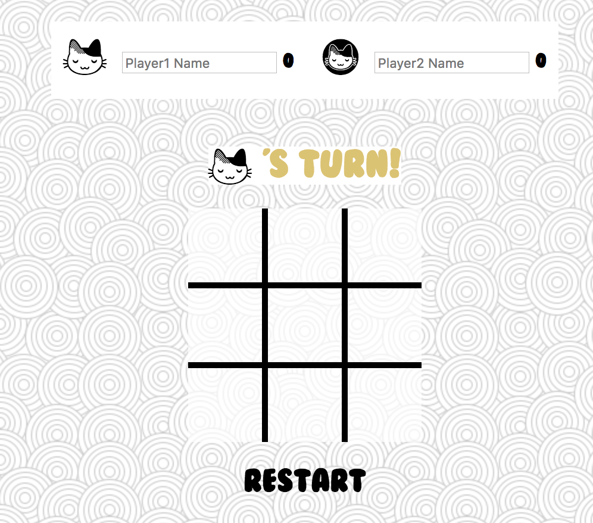
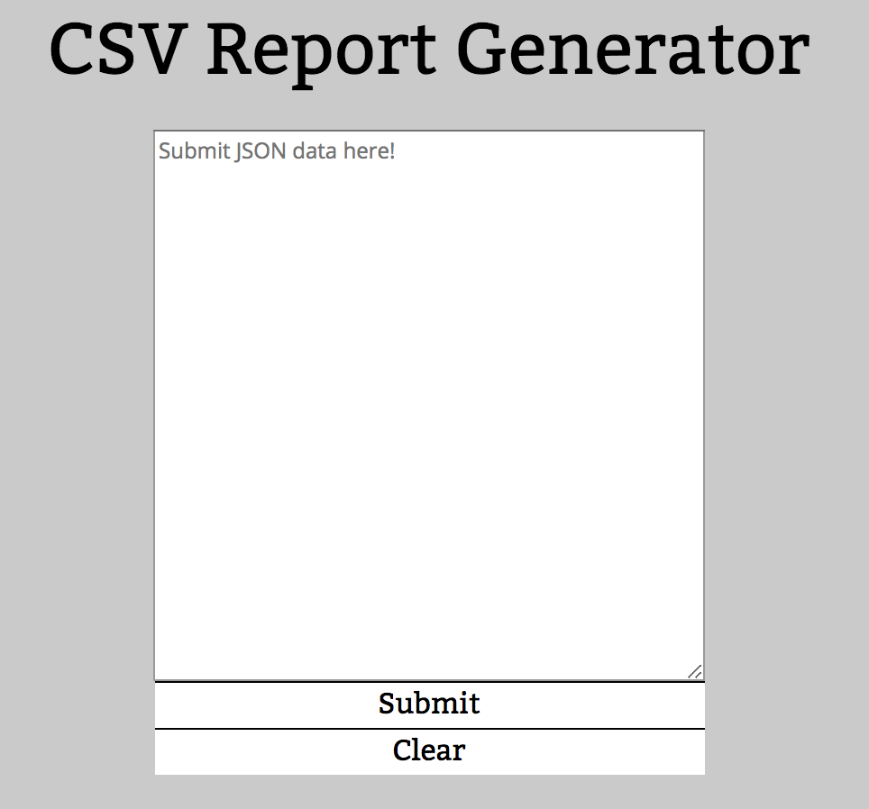
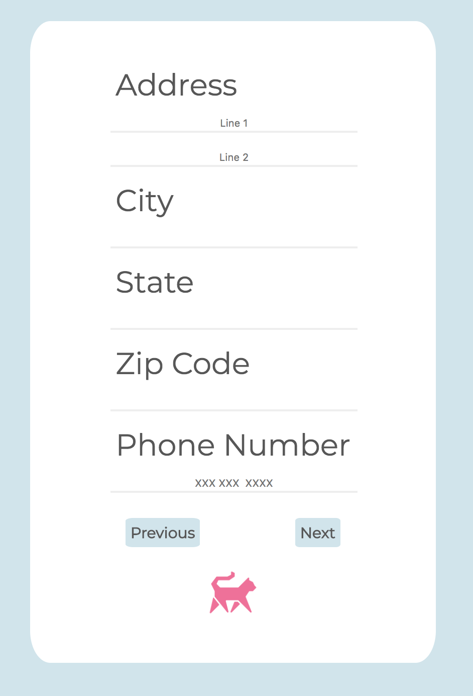
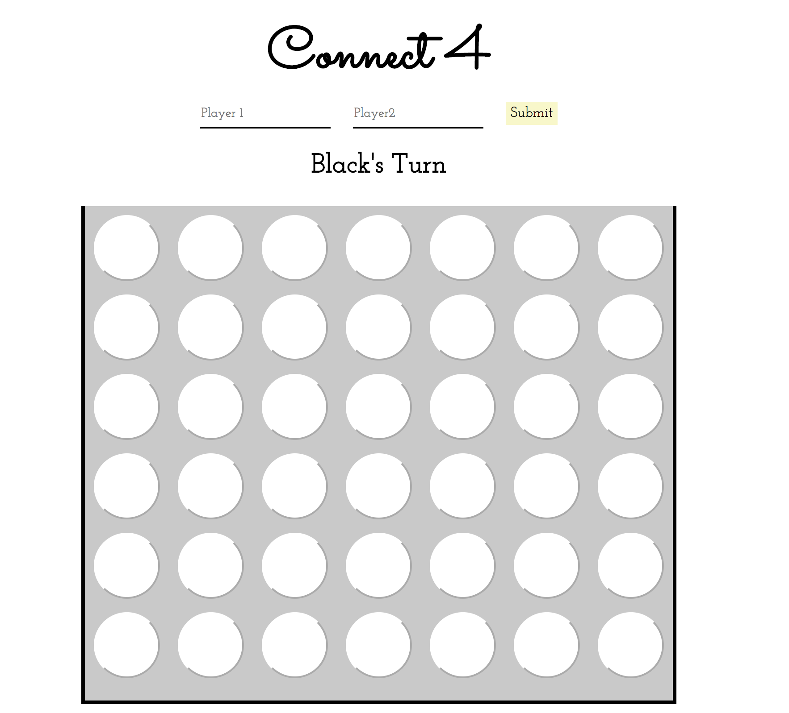

# Mini Apps 
These are mini-apps that I did for fun, to showcase my FE skills..

## Table of Contents

1. [Challenge 1](#TicTacToe)
1. [Challenge 2](#CSVReportGenerator)
1. [Challenge 3](#CheckoutFeature)
1. [Challenge 4](#Connect4)

## TicTacToe
Tic Tac Toe using pure JS.
###Images
<!-- .element height="50%" width="50%" -->

## CSV Report Generator
CSV to JSON generator using jQuery.
###Images
<!-- .element height="50%" width="50%" -->

## Checkout Feature
Single page webapp using MongoDB.
###Images
<!-- .element height="50%" width="50%" -->
<!-- .element height="50%" width="50%" -->

## Connect 4
Connect4 using React.
###Images
<!-- .element height="50%" width="50%" -->

## Requirements
### To Run This Module
Each of the mini apps have different requirements. To interact with them, download this repo and open each of their index.html files.
